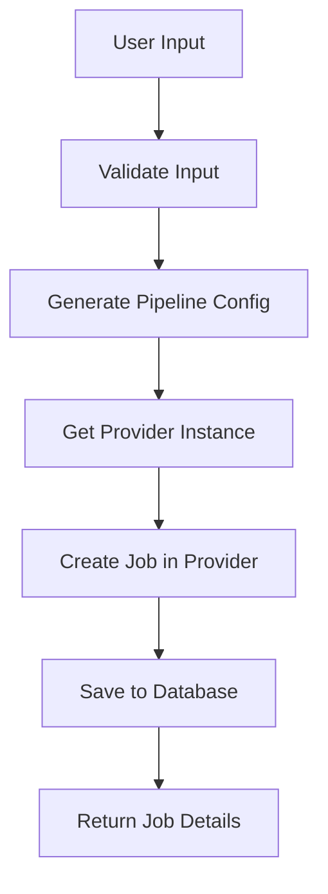

# Deployment System Documentation

## Overview

This document describes the deployment system architecture, focusing on how deployments are created, managed, and executed across different CI/CD providers.

## Core Components

### 1. Database Structure

```sql
-- CI/CD Jobs
cicd_jobs {
  id: uuid                  -- Primary key
  provider_id: uuid         -- Link to provider
  external_id: text         -- Provider's job ID (e.g., Jenkins job name)
  name: text               -- Display name
  description: text        -- Job description
  parameters: jsonb        -- Provider-specific configuration
  trigger_token: text      -- Token for remote triggering
  trigger_url: text        -- Complete URL for triggering
  job_url: text           -- Direct URL to job in CI/CD system
  created_at: timestamp
  updated_at: timestamp
  creator_id: uuid
  team_id: uuid
}

-- CI/CD Providers
cicd_providers {
  id: uuid
  type: text              -- 'jenkins', 'github', 'gitlab', 'circleci'
  name: text              -- Display name
  url: text              -- Provider base URL
  port: integer          -- Optional port number
  config: jsonb          -- Provider configuration including auth
  tenant_id: text
  team_id: uuid
  creator_id: uuid
}

-- Deployment-CICD Mappings
deployment_cicd_mappings {
  id: uuid
  deployment_id: uuid     -- Reference to deployments
  cicd_job_id: uuid      -- Reference to cicd_jobs
  parameters: jsonb       -- Build parameters
  build_number: text     -- Latest build number
  build_url: text       -- Latest build URL
  created_at: timestamp
  updated_at: timestamp
}
```

### 2. Provider Interface

```typescript
interface CICDProvider {
  // Core methods all providers must implement
  initialize(config: CICDProviderConfig): Promise<void>;
  createJob(name: string, config: CICDJobConfig): Promise<CICDResponse>;
  triggerJob(jobId: string, params?: Record<string, any>): Promise<CICDResponse>;
  getJobStatus(jobId: string): Promise<CICDResponse>;
}
```

### 3. Pipeline Generator

```typescript
class PipelineGenerator {
  static generateProviderConfig(
    provider: 'jenkins' | 'github' | 'gitlab' | 'circleci',
    options: {
      name: string;
      repository: RepositoryConfig;
      scripts: ScriptConfig[];
      hosts: HostConfig[];
      triggers?: TriggerConfig;
    },
  ): ProviderSpecificConfig;
}
```

## Workflow

### 1. Deployment Creation



#### Steps:

1. **User Input Collection**

   - Basic deployment info (name, description)
   - Repository selection and branch
   - Script selection and parameters
   - Target hosts selection
   - CI/CD provider selection
   - Schedule configuration

2. **Provider Configuration**

   - Get provider instance from factory
   - Initialize with credentials
   - Validate connection

3. **Pipeline Generation**

   - Generate provider-specific configuration
   - Create job structure
   - Set up triggers and parameters

4. **Job Creation**
   - Create job in provider system
   - Store job details in database
   - Create deployment-job mapping

### 2. Provider-Specific Implementation

#### Jenkins

- Creates folder structure: `{tenant}/{team}/{job}`
- Generates complete job XML with:
  - Pipeline script (Jenkinsfile)
  - Build triggers
  - Parameters
  - Description

#### GitHub Actions

- Creates workflow file in `.github/workflows`
- Sets up repository secrets
- Configures webhook triggers

#### GitLab CI

- Creates `.gitlab-ci.yml`
- Sets up pipeline variables
- Configures webhook triggers

#### CircleCI

- Creates `config.yml`
- Sets up project in CircleCI
- Configures context & environment

### 3. Job Triggering

```typescript
// Via API
POST /api/deployments/jobs/{jobId}/trigger
{
  "parameters": {
    "VERSION": "1.0.0"
  }
}

// Via webhook
POST {trigger_url}?token={trigger_token}
```

## Security Considerations

### 1. Authentication

- Provider credentials stored securely
- Unique trigger tokens per job
- Team-based access control

### 2. Best Practices

- Minimal required permissions
- Regular token rotation
- Audit logging
- Input validation

## Error Handling

### 1. Creation Errors

- Provider unavailable
- Invalid configuration
- Permission denied
- Resource limits

### 2. Trigger Errors

- Invalid token
- Job not found
- Provider offline
- Parameter validation

## Monitoring

### 1. Job Health

- Regular URL validation
- Provider connectivity checks
- Job status monitoring

### 2. Metrics

- Trigger frequency
- Success/failure rates
- Response times
- Resource usage

## Best Practices

### 1. Job Configuration

- Use standardized naming conventions
- Include adequate logging
- Set appropriate timeouts
- Configure proper cleanup

### 2. Security

- Rotate trigger tokens periodically
- Use minimal required permissions
- Validate all inputs
- Sanitize parameters

### 3. Maintenance

- Regular validation of stored URLs
- Cleanup of unused jobs
- Monitoring of job statuses
- Audit of access patterns

## Code Structure

### Types and Interfaces
Location: `src/types-new/`

```typescript
// cicd-provider.ts
interface CICDProvider {
  initialize(config: CICDProviderConfig): void;
  createJob(name: string, config: CICDJobConfig): Promise<CICDResponse>;
  triggerJob(jobId: string, params?: Record<string, any>): Promise<CICDResponse>;
  getJobStatus(jobId: string): Promise<CICDResponse>;
}

// cicd-pipeline.ts
interface CICDPipelineConfig {
  name: string;
  description?: string;
  repository: {
    id: string;
    url?: string;
    branch?: string;
  };
  stages: PipelineStage[];
  parameters?: PipelineParameter[];
  triggerToken?: string;
}
```

### Implementation Structure
src/lib/services/cicd/
├── providers/
│ ├── jenkins/
│ │ ├── index.ts # Jenkins provider implementation
│ │ └── pipeline.ts # Jenkins pipeline implementation
│ ├── github/
│ │ ├── index.ts # GitHub provider implementation
│ │ └── pipeline.ts # GitHub pipeline implementation
│ └── index.ts # Provider exports
├── factory.ts # Provider factory
└── service.ts # CICD service


### Files to be Deprecated
The following files will be removed as part of the migration:
- `src/lib/services/cicd/pipelineGenerator.ts`
- `src/lib/services/cicd/jenkinsProvider.ts`
- `src/lib/services/cicd/githubProvider.ts`
- `src/lib/services/cicd/types.ts`

### Migration Plan
1. Create new type definitions in `src/types-new/`
   - `cicd-provider.ts`: Core provider interfaces
   - `cicd-pipeline.ts`: Pipeline configuration types
   - `index.ts`: Type exports

2. Create provider-specific implementations
   - Each provider in its own directory
   - Clear separation between provider and pipeline logic
   - Provider-specific types contained within provider directory

3. Update service layer
   - Simplified CICD service
   - Provider-agnostic operations
   - Clear separation of concerns

### Provider Implementation
Each provider implementation will:
1. Follow the `CICDProvider` interface
2. Handle its own pipeline generation
3. Manage provider-specific configurations
4. Implement error handling and logging
5. Handle authentication and API communication

