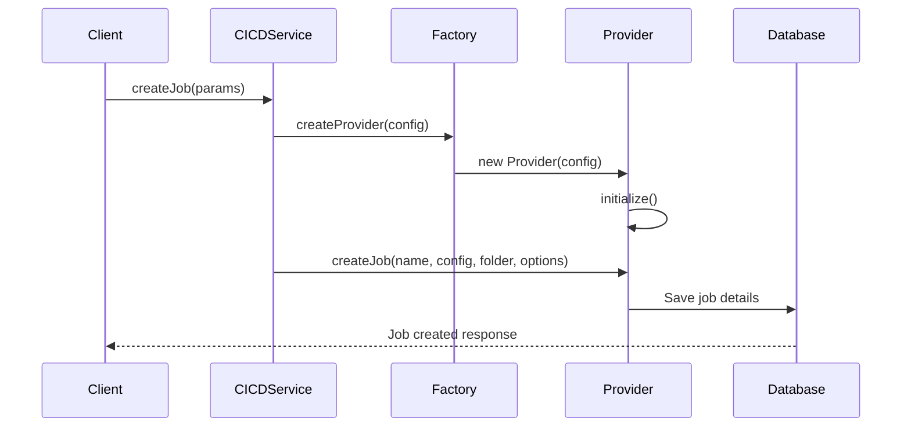
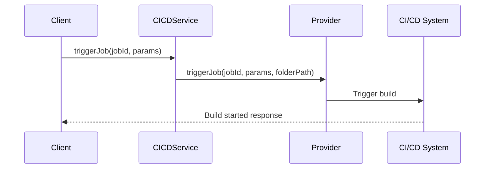

# Deployment System Documentation

## Overview

This document describes the deployment system architecture, focusing on how deployments are created, managed, and executed across different CI/CD providers.

## Core Components

### 1. Database Structure

```sql
-- CI/CD Jobs
cicd_jobs {
  id: uuid                  -- Primary key
  provider_id: uuid         -- Link to provider
  external_id: text         -- Provider's job ID (e.g., Jenkins job name)
  name: text               -- Display name
  description: text        -- Job description
  parameters: jsonb        -- Provider-specific configuration
  trigger_token: text      -- Token for remote triggering
  trigger_url: text        -- Complete URL for triggering
  job_url: text           -- Direct URL to job in CI/CD system
  created_at: timestamp
  updated_at: timestamp
  creator_id: uuid
  team_id: uuid
}

-- CI/CD Providers
cicd_providers {
  id: uuid
  type: text              -- 'jenkins', 'github', 'gitlab', 'circleci'
  name: text              -- Display name
  url: text              -- Provider base URL
  port: integer          -- Optional port number
  auth_type: text        -- 'token' or 'basic'
  credentials: jsonb     -- Provider authentication details
  tenant_id: text
  team_id: uuid
  creator_id: uuid
  is_active: boolean
  created_at: timestamp
  updated_at: timestamp
}

-- Deployment-CICD Mappings
deployment_cicd_mappings {
  id: uuid
  deployment_id: uuid     -- Reference to deployments
  cicd_job_id: uuid      -- Reference to cicd_jobs
  parameters: jsonb       -- Build parameters
  build_number: text     -- Latest build number
  build_url: text       -- Latest build URL
  created_at: timestamp
  updated_at: timestamp
}
```

### 2. Core Service Architecture

The system follows a layered architecture with clear separation of concerns:

```typescript
// src/lib/services/cicd/service.ts
class CICDService {
  initialize(config: CICDProviderConfig): boolean;
  createJob(params: CreateCICDJobParams): Promise<CICDResponse<CICDJob>>;
  triggerJob(jobId: string, parameters?: Record<string, any>): Promise<CICDResponse<CICDJob>>;
  getJobStatus(jobId: string): Promise<CICDResponse<CICDJob>>;
}

// src/lib/services/cicd/factory.ts
class CICDProviderFactory {
  static createProvider(config: CICDProviderConfig): CICDProvider | null;
}
```

### 3. Type System

Located in `src/types-new/`:

```typescript
// cicd-provider.ts
interface CICDProvider {
  id: string;
  name: string;
  type: CICDProviderType;
  url: string;
  auth_type: CICDAuthType;
  is_active: boolean;
  team_id?: string;

  initialize(config: CICDProviderConfig): void;
  createJob(
    name: string,
    config: CICDJobConfig,
    folder?: string,
    options?: Record<string, any>,
  ): Promise<CICDResponse<CICDJob>>;
  triggerJob(
    jobId: string,
    parameters?: Record<string, any>,
    folderPath?: string,
  ): Promise<CICDResponse<CICDBuild>>;
  getJobStatus(jobId: string): Promise<CICDResponse<CICDJob>>;
  getBuildStatus(jobId: string, buildId: string): Promise<CICDResponse<CICDBuild>>;
  getBuildLogs(jobId: string, buildId: string): Promise<CICDResponse<string>>;
  deleteJob(jobId: string): Promise<CICDResponse<boolean>>;
  testConnection(): Promise<CICDResponse<boolean>>;
}

interface CICDProviderConfig {
  id: string;
  type: CICDProviderType;
  name: string;
  url: string;
  port?: number;
  auth_type: CICDAuthType;
  credentials: Record<string, any>;
  team_id?: string;
}

// cicd-job.ts
interface CreateCICDJobParams {
  name: string;
  description?: string;
  repository: {
    url: string;
    branch: string;
  };
  hosts?: Array<{
    name: string;
    ip: string;
    environment: string;
  }>;
  scripts?: Array<{
    path: string;
    parameters?: Record<string, any>;
  }>;
}

interface CICDJob {
  id: string;
  name: string;
  provider_id: string;
  external_id: string;
  description?: string;
  parameters?: Record<string, any>;
  trigger_token?: string;
  trigger_url?: string;
  job_url?: string;
  status?: string;
  created_at?: string;
  updated_at?: string;
}

interface CICDBuild {
  id: string;
  job_id: string;
  number: string;
  status: 'pending' | 'running' | 'success' | 'failure' | 'unknown';
  url?: string;
  started_at?: string;
  finished_at?: string;
}
```

## Implementation Structure

Current folder structure:

```
src/
├── types-new/
│   ├── cicd-provider.ts   # Provider interfaces and configs
│   ├── cicd-job.ts        # Job related types
│   └── cicd-pipeline.ts   # Pipeline configuration types
├── lib/
│   └── services/
│       └── cicd/
│           ├── service.ts         # Main CICD service
│           ├── factory.ts         # Provider factory
│           ├── jenkinsProvider.ts # Jenkins implementation
│           └── jenkinsPipeline.ts # Jenkins pipeline generator
```

## Provider Implementation Details

### Jenkins Provider

The Jenkins provider implementation (`jenkinsProvider.ts`) includes:

1. **Authentication**

   - Support for both basic auth and token-based authentication
   - CSRF token handling for Jenkins security
   - Connection testing capabilities

2. **Job Management**

   - Pipeline job creation with folder support
   - Dynamic Jenkinsfile generation
   - Parameter handling and validation
   - Build triggering with parameter support

3. **Status Monitoring**

   - Real-time build status tracking
   - Build log retrieval
   - Error handling and status mapping

4. **Pipeline Generation**
   - Dynamic pipeline script generation
   - Support for multiple deployment hosts
   - Script execution stages
   - Environment-specific configurations

## Workflow

### 1. Job Creation Flow



### 2. Job Triggering Flow



## Security Considerations

1. **Authentication**

   - Provider credentials stored securely in `credentials` field
   - Support for token and basic authentication
   - CSRF token handling for providers that require it
   - Team-based access control

2. **Best Practices**
   - Minimal required permissions
   - Regular token rotation
   - Comprehensive audit logging
   - Input validation and sanitization
   - Secure URL handling

## Error Handling

The service implements consistent error handling with detailed responses:

```typescript
interface CICDResponse<T = any> {
  success: boolean;
  error?: string;
  data?: T;
}
```

Common error scenarios handled:

1. Provider initialization failures
2. Job creation errors
3. Trigger failures
4. Status check timeouts
5. Authentication errors
6. Network connectivity issues

## Monitoring

1. **Service Health**

   - Provider connectivity checks
   - Job status monitoring
   - Response time tracking
   - Build status tracking

2. **Logging**
   - Standardized log format: `[@service:cicd:component]`
   - Detailed error tracking
   - Audit trail for all operations
   - Build log management

## Future Enhancements

1. **Additional Providers**

   - GitHub Actions implementation
   - GitLab CI implementation
   - CircleCI implementation

2. **Features**
   - Pipeline template system
   - Advanced scheduling
   - Retry mechanisms
   - Webhook management
   - Build artifact management

## Best Practices

1. **Code Organization**

   - Clear separation of concerns
   - Provider-specific logic isolation
   - Type-safe interfaces
   - Consistent error handling
   - Modular pipeline generation

2. **Security**

   - Credential management
   - Access control
   - Input validation
   - Audit logging
   - CSRF protection

3. **Maintenance**
   - Regular provider testing
   - Log monitoring
   - Performance tracking
   - Documentation updates
