# Supabase Database Schema

This document provides a comprehensive overview of the database schema used in this application.

## Table of Contents
- [Entity Relationship Diagram](#entity-relationship-diagram)
- [Tables](#tables)
- [Relationships](#relationships)
- [Row-Level Security Policies](#row-level-security-policies)

## Entity Relationship Diagram

```mermaid
erDiagram
    TENANTS ||--o{ PROFILES : "has"
    TENANTS ||--o{ CICD_PROVIDERS : "has"
    TENANTS ||--o{ DEPLOYMENTS : "contains"
    
    PROFILES ||--o{ GIT_PROVIDERS : "owns"
    PROFILES ||--o{ DEPLOYMENTS : "creates"
    PROFILES ||--o{ PROFILE_REPOSITORY_PINS : "pins"
    
    GIT_PROVIDERS ||--o{ REPOSITORIES : "contains"
    
    REPOSITORIES ||--o{ DEPLOYMENTS : "used_by"
    REPOSITORIES ||--o{ PROFILE_REPOSITORY_PINS : "is_pinned"
    
    CICD_PROVIDERS ||--o{ CICD_JOBS : "defines"
    
    DEPLOYMENTS ||--o{ DEPLOYMENT_LOGS : "generates"
    DEPLOYMENTS ||--o{ DEPLOYMENT_CICD_MAPPINGS : "mapped_to"
    
    CICD_JOBS ||--o{ DEPLOYMENT_CICD_MAPPINGS : "connected_to"
    
    TENANTS {
        text id PK
        text name
        text domain
        timestamp created_at
        timestamp updated_at
    }
    
    PROFILES {
        uuid id PK
        text avatar_url
        text tenant_id FK
        text role
        text tenant_name
    }
    
    GIT_PROVIDERS {
        uuid id PK
        uuid profile_id FK
        text type
        text name
        text display_name
        text server_url
        text access_token
        text refresh_token
        timestamp expires_at
        boolean is_configured
        timestamp last_synced
        timestamp created_at
        timestamp updated_at
    }
    
    REPOSITORIES {
        uuid id PK
        uuid provider_id FK
        text provider_type
        text name
        text description
        text owner
        text url
        boolean is_private
        text default_branch
        text language
        text sync_status
        timestamp last_synced_at
        text error
        timestamp created_at
        timestamp updated_at
    }
    
    PROFILE_REPOSITORY_PINS {
        uuid profile_id FK
        uuid repository_id FK
        timestamp created_at
    }
    
    CICD_PROVIDERS {
        uuid id PK
        text type
        text name
        text url
        jsonb config
        text tenant_id FK
        timestamp created_at
        timestamp updated_at
    }
    
    CICD_JOBS {
        uuid id PK
        uuid provider_id FK
        text external_id
        text name
        text description
        jsonb parameters
        timestamp created_at
        timestamp updated_at
    }
    
    DEPLOYMENTS {
        uuid id PK
        text name
        text description
        uuid repository_id FK
        text status
        text schedule_type
        timestamp scheduled_time
        array scripts_path
        array host_ids
        uuid user_id FK
        text tenant_id FK
        text cron_expression
        integer repeat_count
        jsonb environment_vars
        array scripts_parameters
        timestamp created_at
        timestamp started_at
        timestamp completed_at
        timestamp updated_at
    }
    
    DEPLOYMENT_LOGS {
        uuid id PK
        uuid deployment_id FK
        text level
        text message
        timestamp timestamp
    }
    
    DEPLOYMENT_CICD_MAPPINGS {
        uuid id PK
        uuid deployment_id FK
        uuid cicd_job_id FK
        jsonb parameters
        text build_number
        text build_url
        timestamp created_at
        timestamp updated_at
    }
    
    HOSTS {
        text id PK
        text name
        text description
        text type
        text ip
        integer port
        text user
        text password
        text status
        boolean is_windows
        timestamp created_at
        timestamp updated_at
    }
```

## Tables

### tenants
Stores information about different organizations/tenants in the system.

| Column | Type | Nullable | Default | Description |
|--------|------|----------|---------|-------------|
| id | text | NO | uuid_generate_v4() | Primary key |
| name | text | NO | | Tenant name |
| domain | text | YES | | Tenant domain |
| created_at | timestamp with time zone | NO | CURRENT_TIMESTAMP | Creation timestamp |
| updated_at | timestamp with time zone | NO | CURRENT_TIMESTAMP | Update timestamp |

### profiles
Stores user profile information.

| Column | Type | Nullable | Default | Description |
|--------|------|----------|---------|-------------|
| id | uuid | NO | auth.uid() | Primary key |
| avatar_url | text | YES | | URL to user avatar |
| tenant_id | text | YES | | Foreign key to tenants |
| role | text | YES | 'admin' | User role |
| tenant_name | text | YES | 'pro' | Name of tenant |

### git_providers
Stores configuration for Git providers (GitHub, GitLab, etc.).

| Column | Type | Nullable | Default | Description |
|--------|------|----------|---------|-------------|
| id | uuid | NO | uuid_generate_v4() | Primary key |
| profile_id | uuid | NO | | Foreign key to profiles |
| type | text | NO | | Provider type (github, gitlab, etc.) |
| name | text | NO | | Provider name |
| display_name | text | YES | | Display name |
| server_url | text | YES | | URL to Git server |
| access_token | text | YES | | OAuth access token |
| refresh_token | text | YES | | OAuth refresh token |
| expires_at | timestamp without time zone | YES | | Token expiration timestamp |
| is_configured | boolean | YES | false | Configuration status |
| last_synced | timestamp without time zone | YES | | Last sync timestamp |
| created_at | timestamp without time zone | YES | now() | Creation timestamp |
| updated_at | timestamp without time zone | YES | now() | Update timestamp |

### repositories
Stores Git repositories.

| Column | Type | Nullable | Default | Description |
|--------|------|----------|---------|-------------|
| id | uuid | NO | uuid_generate_v4() | Primary key |
| provider_id | uuid | NO | | Foreign key to git_providers |
| provider_type | text | NO | | Type of Git provider |
| name | text | NO | | Repository name |
| description | text | YES | | Repository description |
| owner | text | YES | | Repository owner |
| url | text | YES | | Repository URL |
| is_private | boolean | YES | false | Privacy status |
| default_branch | text | YES | 'main' | Default branch name |
| language | text | YES | | Primary programming language |
| sync_status | text | YES | 'IDLE' | Synchronization status |
| last_synced_at | timestamp without time zone | YES | | Last sync timestamp |
| error | text | YES | | Error message if sync failed |
| created_at | timestamp without time zone | YES | now() | Creation timestamp |
| updated_at | timestamp without time zone | YES | now() | Update timestamp |

### profile_repository_pins
Junction table for user profile and repository pins.

| Column | Type | Nullable | Default | Description |
|--------|------|----------|---------|-------------|
| profile_id | uuid | NO | | Foreign key to profiles |
| repository_id | uuid | NO | | Foreign key to repositories |
| created_at | timestamp without time zone | YES | now() | Creation timestamp |

### cicd_providers
Stores CI/CD provider configurations.

| Column | Type | Nullable | Default | Description |
|--------|------|----------|---------|-------------|
| id | uuid | NO | uuid_generate_v4() | Primary key |
| type | text | NO | | Provider type |
| name | text | NO | | Provider name |
| url | text | NO | | Provider URL |
| config | jsonb | NO | | Provider configuration |
| tenant_id | text | YES | | Foreign key to tenants |
| created_at | timestamp with time zone | YES | now() | Creation timestamp |
| updated_at | timestamp with time zone | YES | now() | Update timestamp |

### cicd_jobs
Stores CI/CD job definitions.

| Column | Type | Nullable | Default | Description |
|--------|------|----------|---------|-------------|
| id | uuid | NO | uuid_generate_v4() | Primary key |
| provider_id | uuid | YES | | Foreign key to cicd_providers |
| external_id | text | NO | | External job ID |
| name | text | NO | | Job name |
| description | text | YES | | Job description |
| parameters | jsonb | YES | | Job parameters |
| created_at | timestamp with time zone | YES | now() | Creation timestamp |
| updated_at | timestamp with time zone | YES | now() | Update timestamp |

### deployments
Stores deployment configurations and status.

| Column | Type | Nullable | Default | Description |
|--------|------|----------|---------|-------------|
| id | uuid | NO | uuid_generate_v4() | Primary key |
| name | text | NO | | Deployment name |
| description | text | YES | | Deployment description |
| repository_id | uuid | YES | | Foreign key to repositories |
| status | text | NO | 'pending' | Deployment status |
| schedule_type | text | YES | | Schedule type |
| scheduled_time | timestamp with time zone | YES | | Scheduled time |
| scripts_path | ARRAY | YES | | Paths to deployment scripts |
| host_ids | ARRAY | YES | | IDs of target hosts |
| user_id | uuid | YES | | Foreign key to profiles |
| tenant_id | text | YES | | Foreign key to tenants |
| cron_expression | text | YES | | Cron schedule expression |
| repeat_count | integer | YES | 0 | Number of repeats |
| environment_vars | jsonb | YES | '[]' | Environment variables |
| scripts_parameters | ARRAY | YES | | Script parameters |
| created_at | timestamp with time zone | YES | now() | Creation timestamp |
| started_at | timestamp with time zone | YES | | Start timestamp |
| completed_at | timestamp with time zone | YES | | Completion timestamp |
| updated_at | timestamp with time zone | YES | now() | Update timestamp |

### deployment_logs
Stores logs from deployments.

| Column | Type | Nullable | Default | Description |
|--------|------|----------|---------|-------------|
| id | uuid | NO | uuid_generate_v4() | Primary key |
| deployment_id | uuid | YES | | Foreign key to deployments |
| level | text | NO | | Log level |
| message | text | NO | | Log message |
| timestamp | timestamp with time zone | YES | now() | Log timestamp |

### deployment_cicd_mappings
Maps deployments to CI/CD jobs.

| Column | Type | Nullable | Default | Description |
|--------|------|----------|---------|-------------|
| id | uuid | NO | uuid_generate_v4() | Primary key |
| deployment_id | uuid | YES | | Foreign key to deployments |
| cicd_job_id | uuid | YES | | Foreign key to cicd_jobs |
| parameters | jsonb | YES | | Mapping parameters |
| build_number | text | YES | | Build number |
| build_url | text | YES | | Build URL |
| created_at | timestamp with time zone | YES | now() | Creation timestamp |
| updated_at | timestamp with time zone | YES | now() | Update timestamp |

### hosts
Stores target host information.

| Column | Type | Nullable | Default | Description |
|--------|------|----------|---------|-------------|
| id | text | NO | uuid_generate_v4() | Primary key |
| name | text | NO | | Host name |
| description | text | YES | | Host description |
| type | text | NO | | Host type |
| ip | text | NO | | Host IP address |
| port | integer | YES | | Connection port |
| user | text | YES | | Username for connection |
| password | text | YES | | Password for connection |
| status | text | NO | 'pending' | Host status |
| is_windows | boolean | NO | false | Windows OS flag |
| created_at | timestamp with time zone | NO | CURRENT_TIMESTAMP | Creation timestamp |
| updated_at | timestamp with time zone | NO | CURRENT_TIMESTAMP | Update timestamp |

## Relationships

The database has the following key relationships:

1. **Tenant-based organization**:
   - Tenants have multiple users (profiles)
   - Tenants have multiple CI/CD providers
   - Tenants have multiple deployments

2. **User-Git relationship**:
   - Users (profiles) own Git providers
   - Users create deployments
   - Users can pin repositories

3. **Git structure**:
   - Git providers contain repositories
   - Repositories are used in deployments
   - Repositories can be pinned by users

4. **Deployment workflow**:
   - Deployments target specific hosts
   - Deployments generate logs
   - Deployments can be connected to CI/CD jobs via mappings

## Row-Level Security Policies

The database implements Row-Level Security (RLS) policies to control access to data:

### cicd_jobs Policies
- Users can only view, insert, update, and delete CI/CD jobs associated with providers in their tenant

### cicd_providers Policies
- Users can only view, insert, update, and delete CI/CD providers associated with their tenant

### deployment_cicd_mappings Policies
- Users can only view, insert, update, and delete mappings for deployments in their tenant

### deployments Policies
- Users can view their own deployments
- Users can insert their own deployments
- Users can update deployments within their tenant
- Users can delete their own deployments within their tenant

### git_providers Policies
- Users can only view, insert, update, and delete Git providers they own

### hosts Policies
- All authenticated users can access hosts
- Service role can perform all operations on hosts

### profile_repository_pins Policies
- Users can only view, insert, and delete their own repository pins

### profiles Policies
- Users can only view and update their own profile
- Service role can perform all operations on profiles

### repositories Policies
- Users can only view, insert, update, and delete repositories associated with Git providers they own

### tenants Policies
- All users can view tenants
- Service role can perform all operations on tenants 