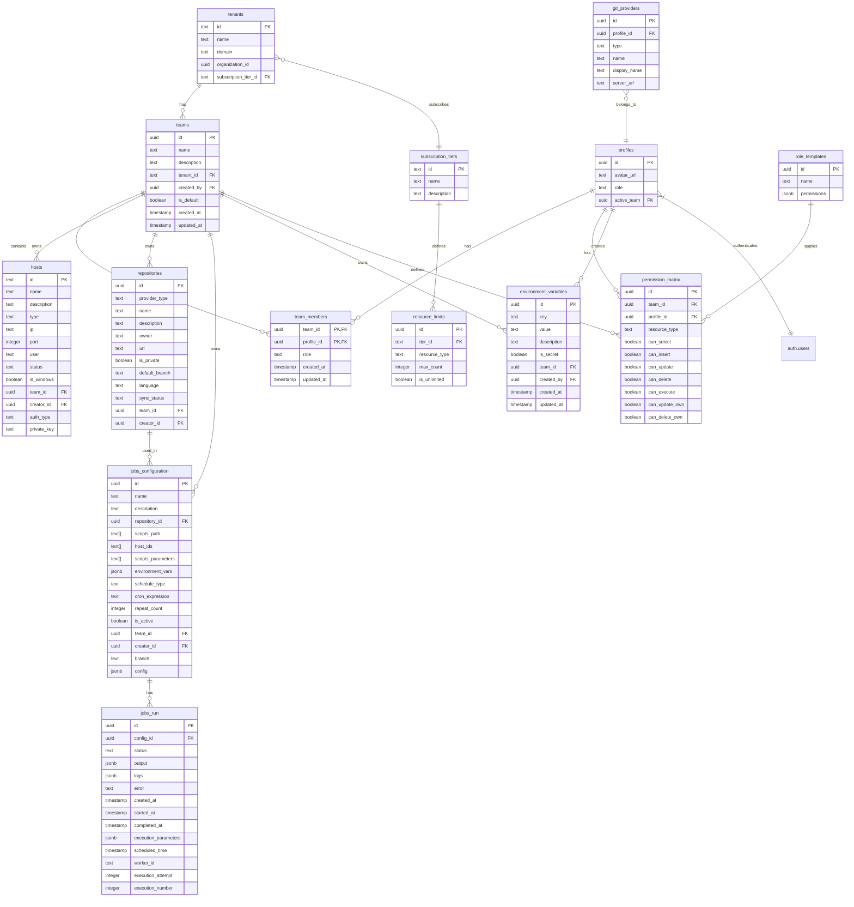

# Supabase Database Schema Documentation (AI-Enhanced)

This document provides a comprehensive overview of the database schema used in the application. The schema is organized into multiple schemas: `public`, `auth`, `storage`, `pgsodium`, `vault`, `realtime`, and `supabase_migrations`.

## Quick Reference for AI Agents

### Core Entity Types

- **Identity entities**: `profiles`, `auth.users`, `tenants`, `teams`, `team_members`, `team_user_profiles`
- **Resource entities**: `hosts`, `repositories`, `jobs_configuration`, `jobs_run`
- **Permission entities**: `permission_matrix`, `role_templates`
- **Configuration entities**: `subscription_tiers`, `resource_limits`, `environment_variables`
- **Connection entities**: `git_providers`

### Naming Conventions

- Primary keys are named `id`
- Foreign keys are named with the singular form of the referenced table plus `_id` (e.g., `team_id`, `tenant_id`)
- Junction tables use a combined name of both entities (e.g., `team_members`, `profile_repository_pins`)
- Boolean flags typically start with `is_` or `can_` prefix (e.g., `is_default`, `can_update`)
- Timestamp fields follow pattern: `created_at`, `updated_at`, `completed_at`, etc.

### Common Query Patterns

1. **Get resources for a specific team**:

   ```sql
   SELECT * FROM repositories WHERE team_id = '{{team_id}}';
   SELECT * FROM hosts WHERE team_id = '{{team_id}}';
   SELECT * FROM environment_variables WHERE team_id = '{{team_id}}';
   ```

2. **Check if user has permission for a resource**:

   ```sql
   SELECT EXISTS (
     SELECT 1 FROM permission_matrix
     WHERE profile_id = '{{user_id}}'
     AND team_id = '{{team_id}}'
     AND resource_type = '{{resource_type}}'
     AND can_{{operation}} = true
   ) as has_permission;
   ```

3. **Get all teams for a user**:

   ```sql
   SELECT t.* FROM teams t
   JOIN team_members tm ON t.id = tm.team_id
   WHERE tm.profile_id = '{{user_id}}';
   ```

4. **Get job runs with configuration details**:

   ```sql
   SELECT jr.*, jc.name as job_name, r.name as repository_name
   FROM jobs_run jr
   JOIN jobs_configuration jc ON jr.config_id = jc.id
   LEFT JOIN repositories r ON jc.repository_id = r.id
   WHERE jc.team_id = '{{team_id}}';
   ```

5. **Get environment variables with creator information**:
   ```sql
   SELECT ev.*, p.email as creator_email
   FROM environment_variables ev
   JOIN profiles p ON ev.created_by = p.id
   WHERE ev.team_id = '{{team_id}}';
   ```

### Multi-Tenancy Implementation

The application implements multi-tenancy at multiple levels:

1. **Team Isolation**: Resources are isolated by `team_id`.
2. **Permission Control**: Access to resources is controlled by the `permission_matrix` table.

When querying data, always filter by the appropriate team context:

```sql
-- Get all repositories for the user's teams
SELECT r.* FROM repositories r
JOIN teams t ON r.team_id = t.id
JOIN team_members tm ON t.id = tm.team_id
WHERE tm.profile_id = '{{user_id}}';
```

## Database Diagram



## Row Level Security (RLS) Policies

Supabase uses PostgreSQL's Row Level Security feature to control access to data at the row level. The following RLS policies are implemented:

### Team-Based Access Policies

Resources like repositories, hosts, and jobs are restricted based on team membership:

- **Repositories Table**:

  ```sql
  CREATE POLICY "repositories_select_policy" ON repositories
    FOR SELECT USING (team_id IN (
      SELECT team_id FROM team_members WHERE profile_id = auth.uid()
    ));
  ```

- **Hosts Table**:

  ```sql
  CREATE POLICY "hosts_select_policy" ON hosts
    FOR SELECT USING (team_id IN (
      SELECT team_id FROM team_members WHERE profile_id = auth.uid()
    ));
  ```

- **Jobs Configuration Table**:

  ```sql
  CREATE POLICY "Team members can view job configurations" ON jobs_configuration
    FOR SELECT USING (team_id IN (
      SELECT team_id FROM team_members WHERE profile_id = auth.uid()
    ));
  ```

- **Environment Variables Table**:

  ```sql
  CREATE POLICY "team_members_select_policy" ON environment_variables
    FOR SELECT USING (team_id IN (
      SELECT team_id FROM team_members WHERE profile_id = auth.uid()
    ));

  CREATE POLICY "team_members_insert_policy" ON environment_variables
    FOR INSERT WITH CHECK (team_id IN (
      SELECT team_id FROM team_members WHERE profile_id = auth.uid()
    ));

  CREATE POLICY "team_members_update_policy" ON environment_variables
    FOR UPDATE USING (team_id IN (
      SELECT team_id FROM team_members WHERE profile_id = auth.uid()
    ));

  CREATE POLICY "team_members_delete_policy" ON environment_variables
    FOR DELETE USING (team_id IN (
      SELECT team_id FROM team_members WHERE profile_id = auth.uid()
    ));
  ```

### Permission-Based Access Policies

For operations like UPDATE, DELETE, and EXECUTE, policies check against the permission matrix:

- **Hosts Table**:
  ```sql
  CREATE POLICY "hosts_update_policy" ON hosts
    FOR UPDATE USING (
      (team_id IN (
        SELECT tm.team_id FROM team_members tm
        WHERE tm.profile_id = auth.uid()
        AND EXISTS (
          SELECT 1 FROM permission_matrix pm
          WHERE pm.profile_id = auth.uid()
          AND pm.team_id = tm.team_id
          AND pm.resource_type = 'hosts'
          AND pm.can_update = true
        )
      ))
      OR
      (creator_id = auth.uid()
        AND EXISTS (
          SELECT 1 FROM permission_matrix pm
          JOIN team_members tm ON pm.team_id = tm.team_id AND pm.profile_id = tm.profile_id
          WHERE pm.profile_id = auth.uid()
          AND tm.team_id = hosts.team_id
          AND pm.resource_type = 'hosts'
          AND pm.can_update_own = true
        )
      )
    );
  ```

### Profile-Based Policies

Some tables like `git_providers` have policies that restrict access based on profile ownership:

- **Git Providers Table**:
  ```sql
  CREATE POLICY "git_providers_select_policy" ON git_providers
    FOR SELECT USING (profile_id = auth.uid());
  ```

## Database Functions and Helpers

### Permission Check Function

```sql
CREATE OR REPLACE FUNCTION check_permission(
  p_profile_id UUID,
  p_team_id UUID,
  p_resource_type TEXT,
  p_operation TEXT,
  p_is_own_resource BOOLEAN DEFAULT false
) RETURNS BOOLEAN AS $$
DECLARE
  v_has_permission BOOLEAN;
BEGIN
  IF p_is_own_resource = TRUE AND
     (p_operation = 'update' OR p_operation = 'delete') THEN
    -- Check own-resource specific permissions
    SELECT
      CASE
        WHEN p_operation = 'update' THEN can_update_own
        WHEN p_operation = 'delete' THEN can_delete_own
        ELSE FALSE
      END INTO v_has_permission
    FROM permission_matrix
    WHERE
      profile_id = p_profile_id AND
      team_id = p_team_id AND
      resource_type = p_resource_type;
  ELSE
    -- Check regular permissions
    SELECT
      CASE
        WHEN p_operation = 'select' THEN can_select
        WHEN p_operation = 'insert' THEN can_insert
        WHEN p_operation = 'update' THEN can_update
        WHEN p_operation = 'delete' THEN can_delete
        WHEN p_operation = 'execute' THEN can_execute
        ELSE FALSE
      END INTO v_has_permission
    FROM permission_matrix
    WHERE
      profile_id = p_profile_id AND
      team_id = p_team_id AND
      resource_type = p_resource_type;
  END IF;

  RETURN COALESCE(v_has_permission, FALSE);
END;
$$ LANGUAGE plpgsql;
```

### Team Membership Check Function

```sql
CREATE OR REPLACE FUNCTION is_team_member(user_id UUID, team_id UUID)
RETURNS BOOLEAN
LANGUAGE SQL
SECURITY DEFINER
AS $$
  SELECT EXISTS (
    SELECT 1
    FROM team_members
    WHERE profile_id = user_id AND team_id = $2
  );
$$;
```

## Public Schema

The `public` schema contains the core application data tables.

### Profiles Table

- **Table**: `profiles`
- **Description**: Extra metadata for users
- **Primary Key**: `id`
- **Foreign Keys**:
  - `id` references `auth.users(id)`
  - `active_team` references `teams(id)`
- **Columns**:
  - `id` (uuid, NOT NULL): User ID from auth.uid()
  - `avatar_url` (text): User's avatar URL
  - `role` (text, DEFAULT 'admin'): User role (admin/viewer/developer/tester)
  - `active_team` (uuid): The team currently active for this user

### Tenants Table

- **Table**: `tenants`
- **Description**: Organization information
- **Primary Key**: `id`
- **Columns**:
  - `id` (text, NOT NULL): Generated UUID
  - `name` (text, NOT NULL): Tenant name
  - `domain` (text): Tenant domain
  - `created_at` (timestamptz, NOT NULL, DEFAULT CURRENT_TIMESTAMP): Creation timestamp
  - `updated_at` (timestamptz, NOT NULL, DEFAULT CURRENT_TIMESTAMP): Last update timestamp
  - `subscription_tier_id` (text): Reference to subscription tier
  - `organization_id` (uuid): External organization ID

### Teams Table

- **Table**: `teams`
- **Primary Key**: `id`
- **Foreign Keys**:
  - `tenant_id` references `tenants(id)`
  - `created_by` references `profiles(id)`
- **Columns**:
  - `id` (uuid, NOT NULL): Generated UUID
  - `name` (text, NOT NULL): Team name
  - `description` (text): Team description
  - `tenant_id` (text, NOT NULL): Reference to tenant
  - `created_by` (uuid): User who created the team
  - `is_default` (boolean, DEFAULT false): Whether this is the default team
  - `created_at` (timestamptz, DEFAULT CURRENT_TIMESTAMP)
  - `updated_at` (timestamptz, DEFAULT CURRENT_TIMESTAMP)

### Team Members Table

- **Table**: `team_members`
- **Primary Keys**: `team_id`, `profile_id`
- **Foreign Keys**:
  - `team_id` references `teams(id)`
  - `profile_id` references `profiles(id)`
- **Columns**:
  - `team_id` (uuid, NOT NULL)
  - `profile_id` (uuid, NOT NULL)
  - `role` (text, NOT NULL): Member role in the team
  - `created_at` (timestamptz, DEFAULT CURRENT_TIMESTAMP)
  - `updated_at` (timestamptz, DEFAULT CURRENT_TIMESTAMP)

### Team User Profiles View

- **Table**: `team_user_profiles`
- **Description**: View that joins user data for team display
- **Columns**:
  - `id` (uuid): User ID
  - `email` (varchar): User email
  - `avatar_url` (text): User avatar URL
  - `raw_user_meta_data` (jsonb): User metadata
  - `full_name` (text): User's full name

### Hosts Table

- **Table**: `hosts`
- **Primary Key**: `id`
- **Foreign Keys**:
  - `creator_id` references `profiles(id)`
  - `team_id` references `teams(id)`
- **Columns**:
  - `id` (text, NOT NULL): Generated UUID
  - `name` (text, NOT NULL): Host name
  - `description` (text): Host description
  - `type` (text, NOT NULL): Host type
  - `ip` (text, NOT NULL): Host IP address
  - `port` (integer): Connection port
  - `user` (text): Username for connection
  - `password` (text): Password for connection
  - `status` (text, NOT NULL, DEFAULT 'pending'): Host status
  - `is_windows` (boolean, NOT NULL, DEFAULT false): Whether the host is a Windows machine
  - `created_at` (timestamptz, NOT NULL, DEFAULT CURRENT_TIMESTAMP)
  - `updated_at` (timestamptz, NOT NULL, DEFAULT CURRENT_TIMESTAMP)
  - `team_id` (uuid): Team this host belongs to
  - `creator_id` (uuid): User who created this host
  - `auth_type` (text, NOT NULL, DEFAULT 'password'): Authentication type
  - `private_key` (text): SSH private key for authentication

### Git Providers Table

- **Table**: `git_providers`
- **Primary Key**: `id`
- **Foreign Keys**:
  - `profile_id` references `profiles(id)`
- **Columns**:
  - `id` (uuid, NOT NULL): Generated UUID
  - `profile_id` (uuid, NOT NULL): User who owns this provider connection
  - `type` (text, NOT NULL): Provider type (github/gitlab/gitea)
  - `name` (text, NOT NULL): Provider name
  - `display_name` (text): Display name
  - `server_url` (text): Server URL for self-hosted instances
  - `access_token` (text): OAuth access token
  - `refresh_token` (text): OAuth refresh token
  - `expires_at` (timestamp): Token expiration time
  - `is_configured` (boolean, DEFAULT false): Whether configuration is complete
  - `last_synced` (timestamp): Last synchronization time
  - `created_at` (timestamp, DEFAULT now())
  - `updated_at` (timestamp, DEFAULT now())

### Repositories Table

- **Table**: `repositories`
- **Primary Key**: `id`
- **Foreign Keys**:
  - `creator_id` references `profiles(id)`
  - `team_id` references `teams(id)`
- **Columns**:
  - `id` (uuid, NOT NULL): Generated UUID
  - `provider_type` (text, NOT NULL): Provider type
  - `name` (text, NOT NULL): Repository name
  - `description` (text): Repository description
  - `owner` (text): Repository owner
  - `url` (text): Repository URL
  - `is_private` (boolean, DEFAULT false): Whether repository is private
  - `default_branch` (text, DEFAULT 'main'): Default branch name
  - `language` (text): Primary repository language
  - `sync_status` (text, DEFAULT 'IDLE'): Sync status (IDLE/SYNCING/SYNCED/ERROR)
  - `last_synced_at` (timestamp): Last sync time
  - `error` (text): Error message from last sync
  - `created_at` (timestamp, DEFAULT now())
  - `updated_at` (timestamp, DEFAULT now())
  - `team_id` (uuid): Team this repository belongs to
  - `creator_id` (uuid): User who created this repository

### Profile Repository Pins Table

- **Table**: `profile_repository_pins`
- **Primary Keys**: `repository_id`, `profile_id`
- **Foreign Keys**:
  - `profile_id` references `profiles(id)`
  - `repository_id` references `repositories(id)`
- **Columns**:
  - `profile_id` (uuid, NOT NULL)
  - `repository_id` (uuid, NOT NULL)
  - `created_at` (timestamp, DEFAULT now())

### Jobs Configuration Table

- **Table**: `jobs_configuration`
- **Primary Key**: `id`
- **Foreign Keys**:
  - `repository_id` references `repositories(id)`
  - `creator_id` references `profiles(id)`
  - `team_id` references `teams(id)`
- **Columns**:
  - `id` (uuid, NOT NULL): Generated UUID
  - `name` (text, NOT NULL): Job name
  - `description` (text): Job description
  - `repository_id` (uuid): Repository reference
  - `team_id` (uuid, NOT NULL): Team reference
  - `creator_id` (uuid, NOT NULL): Creator reference
  - `scripts_path` (text[]): Array of script paths
  - `host_ids` (text[]): Array of host IDs
  - `scripts_parameters` (text[]): Script parameters
  - `environment_vars` (jsonb, DEFAULT '[]'): Environment variables
  - `schedule_type` (text, DEFAULT 'now'): Schedule type
  - `cron_expression` (text): Cron schedule expression
  - `repeat_count` (integer, DEFAULT 0): Number of times to repeat
  - `is_active` (boolean, DEFAULT true): Whether the job is active
  - `created_at` (timestamptz, DEFAULT CURRENT_TIMESTAMP)
  - `updated_at` (timestamptz, DEFAULT CURRENT_TIMESTAMP)
  - `branch` (text, DEFAULT 'main'): Repository branch
  - `config` (jsonb): Additional configuration

### Jobs Run Table

- **Table**: `jobs_run`
- **Primary Key**: `id`
- **Foreign Keys**:
  - `config_id` references `jobs_configuration(id)`
- **Columns**:
  - `id` (uuid, NOT NULL): Generated UUID
  - `config_id` (uuid, NOT NULL): Job configuration reference
  - `status` (text, NOT NULL, DEFAULT 'queued'): Run status
  - `output` (jsonb): Run output
  - `logs` (jsonb): Run logs
  - `error` (text): Error message
  - `created_at` (timestamptz, DEFAULT CURRENT_TIMESTAMP)
  - `updated_at` (timestamptz, DEFAULT CURRENT_TIMESTAMP)
  - `queued_at` (timestamptz, DEFAULT CURRENT_TIMESTAMP)
  - `started_at` (timestamptz): Start time
  - `completed_at` (timestamptz): Completion time
  - `execution_parameters` (jsonb): Execution parameters
  - `scheduled_time` (timestamptz): Scheduled time
  - `worker_id` (text): Worker ID
  - `execution_attempt` (integer, DEFAULT 0): Attempt number
  - `execution_number` (integer, DEFAULT 1): Execution number

### Environment Variables Table

- **Table**: `environment_variables`
- **Primary Key**: `id`
- **Foreign Keys**:
  - `team_id` references `teams(id)`
  - `created_by` references `profiles(id)`
- **Unique Constraints**:
  - Unique pair of `team_id` and `key` (each team can have only one variable with a given key)
- **Columns**:
  - `id` (uuid, NOT NULL, DEFAULT uuid_generate_v4()): Generated UUID
  - `key` (text, NOT NULL): Variable name/key
  - `value` (text, NOT NULL): Variable value (encrypted for secrets)
  - `description` (text): Optional description
  - `is_secret` (boolean, DEFAULT false): Whether the variable is a secret
  - `team_id` (uuid, NOT NULL): Team this variable belongs to
  - `created_by` (uuid, NOT NULL): User who created this variable
  - `created_at` (timestamptz, DEFAULT now()): Creation timestamp
  - `updated_at` (timestamptz, DEFAULT now()): Last update timestamp
- **Indexes**:
  - Primary key index on `id`
  - Index on `team_id` for faster filtering
  - Unique index on `team_id, key` pair

### Subscription Tiers Table

- **Table**: `subscription_tiers`
- **Primary Key**: `id`
- **Columns**:
  - `id` (text, NOT NULL): Tier ID
  - `name` (text, NOT NULL): Tier name
  - `description` (text): Tier description
  - `created_at` (timestamptz, DEFAULT CURRENT_TIMESTAMP)
  - `updated_at` (timestamptz, DEFAULT CURRENT_TIMESTAMP)

### Resource Limits Table

- **Table**: `resource_limits`
- **Primary Key**: `id`
- **Foreign Keys**:
  - `tier_id` references `subscription_tiers(id)`
- **Columns**:
  - `id` (uuid, NOT NULL): Generated UUID
  - `tier_id` (text, NOT NULL): Subscription tier reference
  - `resource_type` (text, NOT NULL): Resource type
  - `max_count` (integer, NOT NULL): Maximum count allowed
  - `is_unlimited` (boolean, DEFAULT false): Whether there's no limit
  - `created_at` (timestamptz, DEFAULT CURRENT_TIMESTAMP)
  - `updated_at` (timestamptz, DEFAULT CURRENT_TIMESTAMP)

### Permission Matrix Table

- **Table**: `permission_matrix`
- **Primary Key**: `id`
- **Foreign Keys**:
  - `team_id` references `teams(id)`
  - `profile_id` references `profiles(id)`
- **Columns**:
  - `id` (uuid, NOT NULL): Generated UUID
  - `team_id` (uuid): Team reference
  - `profile_id` (uuid): Profile reference
  - `resource_type` (text, NOT NULL): Resource type
  - `can_select` (boolean, DEFAULT false): Select permission
  - `can_insert` (boolean, DEFAULT false): Insert permission
  - `can_update` (boolean, DEFAULT false): Update permission
  - `can_delete` (boolean, DEFAULT false): Delete permission
  - `can_update_own` (boolean, DEFAULT true): Update own records permission
  - `can_delete_own` (boolean, DEFAULT true): Delete own records permission
  - `can_execute` (boolean, DEFAULT false): Execute permission
  - `created_at` (timestamptz, DEFAULT now())
  - `updated_at` (timestamptz, DEFAULT now())

### Role Templates Table

- **Table**: `role_templates`
- **Primary Key**: `id`
- **Columns**:
  - `id` (uuid, NOT NULL): Generated UUID
  - `name` (text, NOT NULL): Template name
  - `permissions` (jsonb, NOT NULL): Permission configuration
  - `created_at` (timestamptz, DEFAULT now())
  - `updated_at` (timestamptz, DEFAULT now())

## Auth Schema

This schema is managed by Supabase Auth service and contains authentication-related tables.

### Users Table

- **Table**: `auth.users`
- **Description**: Stores user login data within a secure schema
- **Primary Key**: `id`
- **Key Columns**:
  - `id` (uuid, NOT NULL)
  - `email` (varchar)
  - `phone` (text, UNIQUE)
  - `encrypted_password` (varchar)
  - `email_confirmed_at` (timestamptz)
  - `phone_confirmed_at` (timestamptz)
  - `confirmed_at` (timestamptz)
  - `last_sign_in_at` (timestamptz)
  - `role` (varchar)
  - `raw_app_meta_data` (jsonb)
  - `raw_user_meta_data` (jsonb)
  - `created_at` (timestamptz)
  - `updated_at` (timestamptz)

### Identities Table

- **Table**: `auth.identities`
- **Description**: Stores identities associated to a user
- **Primary Key**: `id`
- **Foreign Keys**:
  - `user_id` references `auth.users(id)`
- **Key Columns**:
  - `id` (uuid, NOT NULL)
  - `provider_id` (text, NOT NULL)
  - `user_id` (uuid, NOT NULL)
  - `identity_data` (jsonb, NOT NULL)
  - `provider` (text, NOT NULL)
  - `email` (text, GENERATED)
  - `created_at` (timestamptz)
  - `updated_at` (timestamptz)

### Sessions Table

- **Table**: `auth.sessions`
- **Description**: Stores session data associated to a user
- **Primary Key**: `id`
- **Foreign Keys**:
  - `user_id` references `auth.users(id)`
- **Key Columns**:
  - `id` (uuid, NOT NULL)
  - `user_id` (uuid, NOT NULL)
  - `created_at` (timestamptz)
  - `updated_at` (timestamptz)
  - `factor_id` (uuid)
  - `not_after` (timestamptz)
  - `ip` (inet)
  - `user_agent` (text)

### Other Auth Tables

- `auth.refresh_tokens`: Store of tokens used to refresh JWT tokens once they expire
- `auth.mfa_factors`: Stores metadata about multi-factor authentication factors
- `auth.mfa_challenges`: Stores metadata about challenge requests made
- `auth.mfa_amr_claims`: Stores authenticator method reference claims for MFA
- `auth.flow_state`: Stores metadata for PKCE logins
- `auth.sso_providers`: Manages SSO identity provider information
- `auth.saml_providers`: Manages SAML Identity Provider connections
- `auth.one_time_tokens`: Stores one-time tokens for various purposes
- `auth.audit_log_entries`: Audit trail for user actions

## Storage Schema

This schema is managed by Supabase Storage service.

### Key Tables

- `storage.buckets`: Storage buckets configuration
- `storage.objects`: Stored objects metadata
- `storage.s3_multipart_uploads`: Multipart upload tracking
- `storage.s3_multipart_uploads_parts`: Parts of multipart uploads

## Other Schemas

### Realtime Schema

- `realtime.subscription`: Manages realtime subscriptions
- `realtime.messages`: Stores realtime messages

### PgSodium Schema

- `pgsodium.key`: Manages encryption keys

### Vault Schema

- `vault.secrets`: Securely stores sensitive information

### Supabase Migrations Schema

- `supabase_migrations.schema_migrations`: Tracks schema migrations
- `supabase_migrations.seed_files`: Tracks seed files for database seeding

## Relationships Overview

The database has a hierarchical structure with:

- Teams grouping users and resources
- Profiles (users) belonging to teams
- Resources (hosts, repositories, jobs) organized by teams
- Permission matrix controlling access to resources

Key relationship paths:

- Team → Team Member → Profile
- Team → Repository/Host/Jobs
- Profile → Git Provider
- Jobs Configuration → Repository/Host
- Jobs Configuration → Jobs Run
