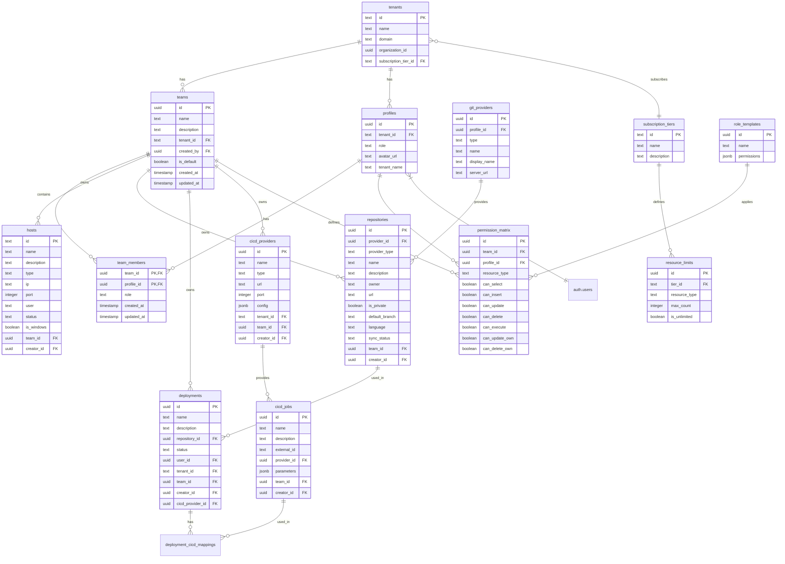

# Supabase Database Schema Documentation (AI-Enhanced)

This document provides a comprehensive overview of the database schema used in the application. The schema is organized into multiple schemas: `public`, `auth`, `storage`, `pgsodium`, `vault`, `realtime`, and `supabase_migrations`.

## Quick Reference for AI Agents

### Core Entity Types
- **Identity entities**: `profiles`, `auth.users`, `tenants`, `teams`, `team_members`
- **Resource entities**: `hosts`, `repositories`, `deployments`, `cicd_providers`, `cicd_jobs`
- **Permission entities**: `permission_matrix`, `role_templates`
- **Configuration entities**: `subscription_tiers`, `resource_limits`
- **Connection entities**: `git_providers`, `deployment_cicd_mappings`

### Naming Conventions
- Primary keys are named `id`
- Foreign keys are named with the singular form of the referenced table plus `_id` (e.g., `team_id`, `tenant_id`)
- Junction tables use a combined name of both entities (e.g., `team_members`, `profile_repository_pins`)
- Boolean flags typically start with `is_` or `can_` prefix (e.g., `is_default`, `can_update`)
- Timestamp fields follow pattern: `created_at`, `updated_at`, `completed_at`, etc.

### Common Query Patterns

1. **Get resources for a specific team**:
   ```sql
   SELECT * FROM repositories WHERE team_id = '{{team_id}}';
   SELECT * FROM hosts WHERE team_id = '{{team_id}}';
   ```

2. **Check if user has permission for a resource**:
   ```sql
   SELECT EXISTS (
     SELECT 1 FROM permission_matrix 
     WHERE profile_id = '{{user_id}}' 
     AND team_id = '{{team_id}}'
     AND resource_type = '{{resource_type}}'
     AND can_{{operation}} = true
   ) as has_permission;
   ```

3. **Get all teams for a user**:
   ```sql
   SELECT t.* FROM teams t
   JOIN team_members tm ON t.id = tm.team_id
   WHERE tm.profile_id = '{{user_id}}';
   ```

4. **Get deployments with related repository and CICD details**:
   ```sql
   SELECT d.*, r.name as repository_name, c.name as cicd_provider_name
   FROM deployments d
   LEFT JOIN repositories r ON d.repository_id = r.id
   LEFT JOIN cicd_providers c ON d.cicd_provider_id = c.id
   WHERE d.team_id = '{{team_id}}';
   ```

### Multi-Tenancy Implementation

The application implements multi-tenancy at multiple levels:

1. **Tenant Isolation**: Each `profile` belongs to a `tenant`, and all `teams` belong to a specific `tenant`.
2. **Team-Based Access**: Within a tenant, resources are further isolated by `team_id`.
3. **Permission Control**: Access to resources is controlled by the `permission_matrix` table.

When querying data, always filter by the appropriate tenant and team context:
```sql
-- Get all repositories for the user's tenant and teams
SELECT r.* FROM repositories r
JOIN teams t ON r.team_id = t.id
JOIN team_members tm ON t.id = tm.team_id
WHERE tm.profile_id = '{{user_id}}'
AND t.tenant_id = (SELECT tenant_id FROM profiles WHERE id = '{{user_id}}');
```

## Database Diagram



## Row Level Security (RLS) Policies

Supabase uses PostgreSQL's Row Level Security feature to control access to data at the row level. The following RLS policies are implemented:

### Tenant Isolation Policies

Most tables in the system have RLS policies that restrict access based on tenant ID:

- **Profiles Table**:
  ```sql
  CREATE POLICY "Users can view their own profile" ON profiles
    FOR SELECT USING (auth.uid() = id);
    
  CREATE POLICY "Users can only see profiles in their tenant" ON profiles
    FOR SELECT USING (tenant_id IN (
      SELECT tenant_id FROM profiles WHERE id = auth.uid()
    ));
  ```

- **Teams Table**:
  ```sql
  CREATE POLICY "Users can view teams in their tenant" ON teams
    FOR SELECT USING (tenant_id IN (
      SELECT tenant_id FROM profiles WHERE id = auth.uid()
    ));
  ```

### Team-Based Access Policies

Resources like repositories, hosts, and deployments have RLS policies that restrict access based on team membership:

- **Repositories Table**:
  ```sql
  CREATE POLICY "Users can view repositories in their teams" ON repositories
    FOR SELECT USING (team_id IN (
      SELECT team_id FROM team_members WHERE profile_id = auth.uid()
    ));
  ```

### Permission-Based Access Policies

For operations like INSERT, UPDATE, and DELETE, policies check against the permission matrix:

- **Hosts Table**:
  ```sql
  CREATE POLICY "Users with insert permission can add hosts" ON hosts
    FOR INSERT WITH CHECK (
      EXISTS (
        SELECT 1 FROM permission_matrix 
        WHERE profile_id = auth.uid() 
        AND team_id = hosts.team_id
        AND resource_type = 'hosts'
        AND can_insert = true
      )
    );
    
  CREATE POLICY "Users with update permission can modify hosts" ON hosts
    FOR UPDATE USING (
      EXISTS (
        SELECT 1 FROM permission_matrix 
        WHERE profile_id = auth.uid() 
        AND team_id = hosts.team_id
        AND resource_type = 'hosts'
        AND (can_update = true OR (can_update_own = true AND creator_id = auth.uid()))
      )
    );
  ```

### Global Policies for System Tables

System tables like `subscription_tiers` and `role_templates` have simpler policies:

- **Subscription Tiers Table**:
  ```sql
  CREATE POLICY "Allow read access for all authenticated users" ON subscription_tiers
    FOR SELECT USING (auth.role() = 'authenticated');
  ```

### Function-Based Policies

Some tables use function-based policies for more complex access logic:

- **Deployments Table**:
  ```sql
  CREATE POLICY "Can execute deployments with execute permission" ON deployments
    FOR UPDATE USING (
      check_permission(auth.uid(), team_id, 'deployments', 'execute', creator_id = auth.uid())
    );
  ```

## Database Functions and Helpers

### Permission Check Function
```sql
CREATE OR REPLACE FUNCTION check_permission(
  p_profile_id UUID, 
  p_team_id UUID, 
  p_resource_type TEXT, 
  p_operation TEXT,
  p_is_own_resource BOOLEAN DEFAULT FALSE
) RETURNS BOOLEAN AS $$
DECLARE
  v_result BOOLEAN;
BEGIN
  -- Check if user has requested permission
  SELECT 
    CASE p_operation
      WHEN 'select' THEN can_select
      WHEN 'insert' THEN can_insert
      WHEN 'update' THEN CASE WHEN p_is_own_resource THEN (can_update OR can_update_own) ELSE can_update END
      WHEN 'delete' THEN CASE WHEN p_is_own_resource THEN (can_delete OR can_delete_own) ELSE can_delete END
      WHEN 'execute' THEN can_execute
      ELSE FALSE
    END INTO v_result
  FROM permission_matrix
  WHERE profile_id = p_profile_id
    AND team_id = p_team_id
    AND resource_type = p_resource_type;
    
  RETURN COALESCE(v_result, FALSE);
END;
$$ LANGUAGE plpgsql;
```

### User Team Function
```sql
CREATE OR REPLACE FUNCTION get_user_teams(p_profile_id UUID) RETURNS SETOF teams AS $$
BEGIN
  RETURN QUERY
  SELECT t.* FROM teams t
  JOIN team_members tm ON t.id = tm.team_id
  WHERE tm.profile_id = p_profile_id;
END;
$$ LANGUAGE plpgsql;
```

## Public Schema

The `public` schema contains the core application data tables.

### Profiles Table
- **Table**: `profiles`
- **Description**: Extra metadata for users
- **Primary Key**: `id`
- **Foreign Keys**: 
  - `id` references `auth.users(id)`
  - `tenant_id` references `tenants(id)`
- **Columns**:
  - `id` (uuid, NOT NULL): User ID from auth.uid()
  - `avatar_url` (text): User's avatar URL
  - `tenant_id` (text): Reference to the tenant this profile belongs to
  - `role` (text, DEFAULT 'admin'): User role (admin/viewer/developer/tester)
  - `tenant_name` (text, DEFAULT 'pro'): Tenant type (trial/pro/tenant)

### Tenants Table
- **Table**: `tenants`
- **Description**: Organization information
- **Primary Key**: `id`
- **Columns**:
  - `id` (text, NOT NULL): Generated UUID
  - `name` (text, NOT NULL): Tenant name
  - `domain` (text, UNIQUE): Tenant domain
  - `created_at` (timestamptz, NOT NULL, DEFAULT CURRENT_TIMESTAMP): Creation timestamp
  - `updated_at` (timestamptz, NOT NULL, DEFAULT CURRENT_TIMESTAMP): Last update timestamp
  - `subscription_tier_id` (text): Reference to subscription tier
  - `organization_id` (uuid): External organization ID

### Teams Table
- **Table**: `teams`
- **Primary Key**: `id`
- **Foreign Keys**:
  - `tenant_id` references `tenants(id)`
  - `created_by` references `profiles(id)`
- **Columns**:
  - `id` (uuid, NOT NULL): Generated UUID
  - `name` (text, NOT NULL): Team name
  - `description` (text): Team description
  - `tenant_id` (text, NOT NULL): Reference to tenant
  - `created_by` (uuid): User who created the team
  - `is_default` (boolean, DEFAULT false): Whether this is the default team
  - `created_at` (timestamptz, DEFAULT CURRENT_TIMESTAMP)
  - `updated_at` (timestamptz, DEFAULT CURRENT_TIMESTAMP)

### Team Members Table
- **Table**: `team_members`
- **Primary Keys**: `team_id`, `profile_id`
- **Foreign Keys**:
  - `team_id` references `teams(id)`
  - `profile_id` references `profiles(id)`
- **Columns**:
  - `team_id` (uuid, NOT NULL)
  - `profile_id` (uuid, NOT NULL)
  - `role` (text, NOT NULL): Member role in the team
  - `created_at` (timestamptz, DEFAULT CURRENT_TIMESTAMP)
  - `updated_at` (timestamptz, DEFAULT CURRENT_TIMESTAMP)

### Hosts Table
- **Table**: `hosts`
- **Primary Key**: `id`
- **Foreign Keys**:
  - `creator_id` references `profiles(id)`
  - `team_id` references `teams(id)`
- **Columns**:
  - `id` (text, NOT NULL): Generated UUID
  - `name` (text, NOT NULL): Host name
  - `description` (text): Host description
  - `type` (text, NOT NULL): Host type
  - `ip` (text, NOT NULL): Host IP address
  - `port` (integer): Connection port
  - `user` (text): Username for connection
  - `password` (text): Password for connection
  - `status` (text, NOT NULL, DEFAULT 'pending'): Host status
  - `is_windows` (boolean, NOT NULL, DEFAULT false): Whether the host is a Windows machine
  - `created_at` (timestamptz, NOT NULL, DEFAULT CURRENT_TIMESTAMP)
  - `updated_at` (timestamptz, NOT NULL, DEFAULT CURRENT_TIMESTAMP)
  - `team_id` (uuid): Team this host belongs to
  - `creator_id` (uuid): User who created this host

### Git Providers Table
- **Table**: `git_providers`
- **Primary Key**: `id`
- **Foreign Keys**:
  - `profile_id` references `profiles(id)`
- **Columns**:
  - `id` (uuid, NOT NULL): Generated UUID
  - `profile_id` (uuid, NOT NULL): User who owns this provider connection
  - `type` (text, NOT NULL): Provider type (github/gitlab/gitea)
  - `name` (text, NOT NULL): Provider name
  - `display_name` (text): Display name
  - `server_url` (text): Server URL for self-hosted instances
  - `access_token` (text): OAuth access token
  - `refresh_token` (text): OAuth refresh token
  - `expires_at` (timestamp): Token expiration time
  - `is_configured` (boolean, DEFAULT false): Whether configuration is complete
  - `last_synced` (timestamp): Last synchronization time
  - `created_at` (timestamp, DEFAULT now())
  - `updated_at` (timestamp, DEFAULT now())

### Repositories Table
- **Table**: `repositories`
- **Primary Key**: `id`
- **Foreign Keys**:
  - `provider_id` references `git_providers(id)`
  - `creator_id` references `profiles(id)`
  - `team_id` references `teams(id)`
- **Columns**:
  - `id` (uuid, NOT NULL): Generated UUID
  - `provider_id` (uuid, NOT NULL): Git provider reference
  - `provider_type` (text, NOT NULL): Provider type
  - `name` (text, NOT NULL): Repository name
  - `description` (text): Repository description
  - `owner` (text): Repository owner
  - `url` (text): Repository URL
  - `is_private` (boolean, DEFAULT false): Whether repository is private
  - `default_branch` (text, DEFAULT 'main'): Default branch name
  - `language` (text): Primary repository language
  - `sync_status` (text, DEFAULT 'IDLE'): Sync status (IDLE/SYNCING/SYNCED/ERROR)
  - `last_synced_at` (timestamp): Last sync time
  - `error` (text): Error message from last sync
  - `created_at` (timestamp, DEFAULT now())
  - `updated_at` (timestamp, DEFAULT now())
  - `team_id` (uuid): Team this repository belongs to
  - `creator_id` (uuid): User who created this repository

### Profile Repository Pins Table
- **Table**: `profile_repository_pins`
- **Primary Keys**: `repository_id`, `profile_id`
- **Foreign Keys**:
  - `profile_id` references `profiles(id)`
  - `repository_id` references `repositories(id)`
- **Columns**:
  - `profile_id` (uuid, NOT NULL)
  - `repository_id` (uuid, NOT NULL)
  - `created_at` (timestamp, DEFAULT now())

### CICD Providers Table
- **Table**: `cicd_providers`
- **Primary Key**: `id`
- **Foreign Keys**:
  - `tenant_id` references `tenants(id)`
  - `creator_id` references `profiles(id)`
  - `team_id` references `teams(id)`
- **Columns**:
  - `id` (uuid, NOT NULL): Generated UUID
  - `type` (text, NOT NULL): Provider type
  - `name` (text, NOT NULL): Provider name
  - `url` (text, NOT NULL): Provider URL
  - `config` (jsonb, NOT NULL): Provider configuration
  - `created_at` (timestamptz, DEFAULT now())
  - `updated_at` (timestamptz, DEFAULT now())
  - `tenant_id` (text): Tenant reference
  - `team_id` (uuid): Team reference
  - `creator_id` (uuid): User who created this provider
  - `port` (integer): Connection port (1-65535)

### CICD Jobs Table
- **Table**: `cicd_jobs`
- **Primary Key**: `id`
- **Foreign Keys**:
  - `provider_id` references `cicd_providers(id)`
  - `creator_id` references `profiles(id)`
  - `team_id` references `teams(id)`
- **Columns**:
  - `id` (uuid, NOT NULL): Generated UUID
  - `provider_id` (uuid): Provider reference
  - `external_id` (text, NOT NULL): External job ID in the provider
  - `name` (text, NOT NULL): Job name
  - `description` (text): Job description
  - `parameters` (jsonb): Job parameters
  - `created_at` (timestamptz, DEFAULT now())
  - `updated_at` (timestamptz, DEFAULT now())
  - `creator_id` (uuid): Creator reference
  - `team_id` (uuid): Team reference

### Deployments Table
- **Table**: `deployments`
- **Description**: Stores deployment information
- **Primary Key**: `id`
- **Foreign Keys**:
  - `repository_id` references `repositories(id)`
  - `user_id` references `profiles(id)` 
  - `creator_id` references `profiles(id)`
  - `tenant_id` references `tenants(id)`
  - `team_id` references `teams(id)`
  - `cicd_provider_id` references `cicd_providers(id)`
- **Columns**:
  - `id` (uuid, NOT NULL): Generated UUID
  - `name` (text, NOT NULL): Deployment name
  - `description` (text): Deployment description
  - `repository_id` (uuid): Repository reference
  - `status` (text, NOT NULL, DEFAULT 'pending'): Deployment status
  - `schedule_type` (text): Schedule type
  - `scheduled_time` (timestamptz): Scheduled run time
  - `scripts_path` (text[]): Array of script paths
  - `host_ids` (uuid[]): Array of host IDs
  - `user_id` (uuid): User reference (deprecated, use creator_id)
  - `created_at` (timestamptz, DEFAULT now())
  - `started_at` (timestamptz): Start time
  - `completed_at` (timestamptz): Completion time
  - `updated_at` (timestamptz, DEFAULT now())
  - `cron_expression` (text): Cron schedule expression
  - `repeat_count` (integer, DEFAULT 0): Number of times to repeat
  - `environment_vars` (jsonb, DEFAULT '[]'): Environment variables
  - `tenant_id` (text): Tenant reference
  - `scripts_parameters` (text[]): Script parameters
  - `team_id` (uuid): Team reference
  - `creator_id` (uuid): Creator reference
  - `cicd_provider_id` (uuid): CICD provider reference

### Deployment CICD Mappings Table
- **Table**: `deployment_cicd_mappings`
- **Primary Key**: `id`
- **Foreign Keys**:
  - `deployment_id` references `deployments(id)`
  - `cicd_job_id` references `cicd_jobs(id)`
- **Columns**:
  - `id` (uuid, NOT NULL): Generated UUID
  - `deployment_id` (uuid): Deployment reference
  - `cicd_job_id` (uuid): CICD job reference
  - `parameters` (jsonb): Parameters for the job
  - `build_number` (text): Build number
  - `build_url` (text): Build URL
  - `created_at` (timestamptz, DEFAULT now())
  - `updated_at` (timestamptz, DEFAULT now())

### Subscription Tiers Table
- **Table**: `subscription_tiers`
- **Primary Key**: `id`
- **Columns**:
  - `id` (text, NOT NULL): Tier ID
  - `name` (text, NOT NULL): Tier name
  - `description` (text): Tier description
  - `created_at` (timestamptz, DEFAULT CURRENT_TIMESTAMP)
  - `updated_at` (timestamptz, DEFAULT CURRENT_TIMESTAMP)

### Resource Limits Table
- **Table**: `resource_limits`
- **Primary Key**: `id`
- **Foreign Keys**:
  - `tier_id` references `subscription_tiers(id)`
- **Columns**:
  - `id` (uuid, NOT NULL): Generated UUID
  - `tier_id` (text, NOT NULL): Subscription tier reference
  - `resource_type` (text, NOT NULL): Resource type
  - `max_count` (integer, NOT NULL): Maximum count allowed
  - `is_unlimited` (boolean, DEFAULT false): Whether there's no limit
  - `created_at` (timestamptz, DEFAULT CURRENT_TIMESTAMP)
  - `updated_at` (timestamptz, DEFAULT CURRENT_TIMESTAMP)

### Permission Matrix Table
- **Table**: `permission_matrix`
- **Primary Key**: `id`
- **Foreign Keys**:
  - `team_id` references `teams(id)`
  - `profile_id` references `profiles(id)`
- **Columns**:
  - `id` (uuid, NOT NULL): Generated UUID
  - `team_id` (uuid): Team reference
  - `profile_id` (uuid): Profile reference
  - `resource_type` (text, NOT NULL): Resource type
  - `can_select` (boolean, DEFAULT false): Select permission
  - `can_insert` (boolean, DEFAULT false): Insert permission
  - `can_update` (boolean, DEFAULT false): Update permission
  - `can_delete` (boolean, DEFAULT false): Delete permission
  - `can_update_own` (boolean, DEFAULT true): Update own records permission
  - `can_delete_own` (boolean, DEFAULT true): Delete own records permission
  - `can_execute` (boolean, DEFAULT false): Execute permission
  - `created_at` (timestamptz, DEFAULT now())
  - `updated_at` (timestamptz, DEFAULT now())

### Role Templates Table
- **Table**: `role_templates`
- **Primary Key**: `id`
- **Columns**:
  - `id` (uuid, NOT NULL): Generated UUID
  - `name` (text, NOT NULL): Template name
  - `permissions` (jsonb, NOT NULL): Permission configuration
  - `created_at` (timestamptz, DEFAULT now())
  - `updated_at` (timestamptz, DEFAULT now())

## Auth Schema

This schema is managed by Supabase Auth service and contains authentication-related tables.

### Users Table
- **Table**: `auth.users`
- **Description**: Stores user login data within a secure schema
- **Primary Key**: `id`
- **Key Columns**:
  - `id` (uuid, NOT NULL)
  - `email` (varchar)
  - `phone` (text, UNIQUE)
  - `encrypted_password` (varchar)
  - `email_confirmed_at` (timestamptz)
  - `phone_confirmed_at` (timestamptz)
  - `confirmed_at` (timestamptz)
  - `last_sign_in_at` (timestamptz)
  - `role` (varchar)
  - `user_role` (text, DEFAULT 'admin')
  - `raw_app_meta_data` (jsonb)
  - `raw_user_meta_data` (jsonb)
  - `created_at` (timestamptz)
  - `updated_at` (timestamptz)

### Identities Table
- **Table**: `auth.identities`
- **Description**: Stores identities associated to a user
- **Primary Key**: `id`
- **Foreign Keys**:
  - `user_id` references `auth.users(id)`
- **Key Columns**:
  - `id` (uuid, NOT NULL)
  - `provider_id` (text, NOT NULL)
  - `user_id` (uuid, NOT NULL)
  - `identity_data` (jsonb, NOT NULL)
  - `provider` (text, NOT NULL)
  - `email` (text, GENERATED)
  - `created_at` (timestamptz)
  - `updated_at` (timestamptz)

### Sessions Table
- **Table**: `auth.sessions`
- **Description**: Stores session data associated to a user
- **Primary Key**: `id`
- **Foreign Keys**:
  - `user_id` references `auth.users(id)`
- **Key Columns**:
  - `id` (uuid, NOT NULL)
  - `user_id` (uuid, NOT NULL)
  - `created_at` (timestamptz)
  - `updated_at` (timestamptz)
  - `factor_id` (uuid)
  - `not_after` (timestamptz)
  - `ip` (inet)
  - `user_agent` (text)

### Other Auth Tables
- `auth.refresh_tokens`: Store of tokens used to refresh JWT tokens once they expire
- `auth.mfa_factors`: Stores metadata about multi-factor authentication factors
- `auth.mfa_challenges`: Stores metadata about challenge requests made
- `auth.mfa_amr_claims`: Stores authenticator method reference claims for MFA
- `auth.flow_state`: Stores metadata for PKCE logins
- `auth.sso_providers`: Manages SSO identity provider information
- `auth.saml_providers`: Manages SAML Identity Provider connections
- `auth.one_time_tokens`: Stores one-time tokens for various purposes
- `auth.audit_log_entries`: Audit trail for user actions

## Storage Schema

This schema is managed by Supabase Storage service.

### Key Tables
- `storage.buckets`: Storage buckets configuration
- `storage.objects`: Stored objects metadata
- `storage.s3_multipart_uploads`: Multipart upload tracking
- `storage.s3_multipart_uploads_parts`: Parts of multipart uploads

## Other Schemas

### Realtime Schema
- `realtime.subscription`: Manages realtime subscriptions
- `realtime.messages`: Stores realtime messages

### PgSodium Schema
- `pgsodium.key`: Manages encryption keys

### Vault Schema
- `vault.secrets`: Securely stores sensitive information

### Supabase Migrations Schema
- `supabase_migrations.schema_migrations`: Tracks schema migrations
- `supabase_migrations.seed_files`: Tracks seed files for database seeding

## Relationships Overview

The database has a hierarchical structure with:
- Tenants at the top level, representing organizations
- Teams within tenants, grouping users and resources
- Profiles (users) belonging to tenants and teams
- Resources (hosts, repositories, deployments, etc.) organized by teams
- Permission matrix controlling access to resources

Key relationship paths:
- Tenant → Team → Team Member → Profile
- Team → Repository/Host/Deployment/CICD Provider
- Profile → Git Provider → Repository
- Deployment → Repository/Host/CICD Job 