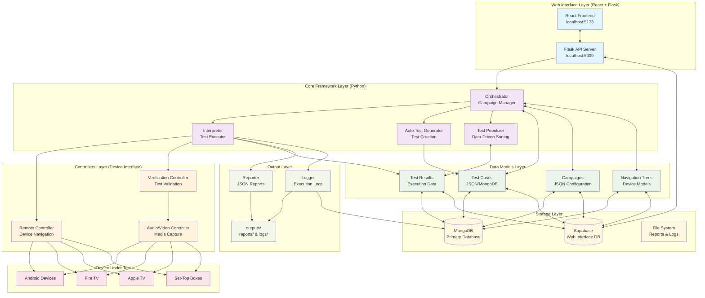
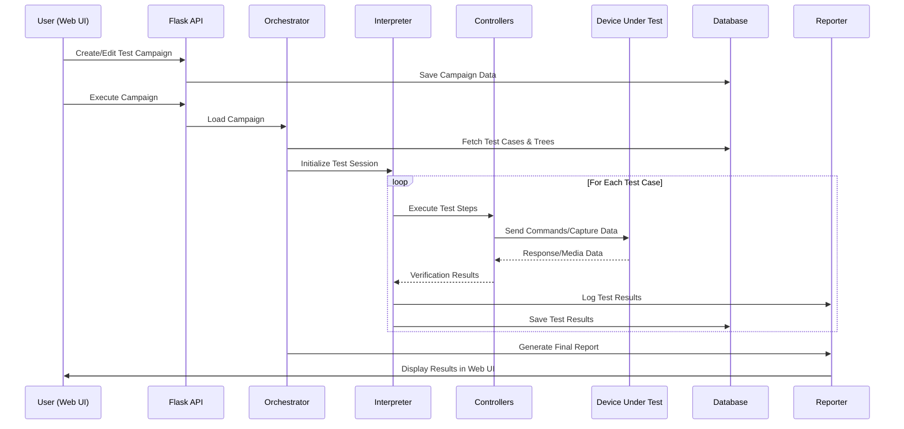

# VirtualPyTest Framework Architecture Diagram

## 🏗️ System Overview

VirtualPyTest is a comprehensive test automation framework with a modern web interface, designed for device-agnostic testing using a model-data approach.

## 📊 High-Level Architecture Diagram



## 🔄 Data Flow Diagram



## 🏛️ Component Architecture Details

### 1. Web Interface Layer

#### React Frontend (`localhost:5173`)

- **Navigation Components**: `NavigationBar.tsx`, `NavigationDropdown.tsx`
- **Page Components**: `Dashboard.tsx`, `TestCaseEditor.tsx`, `CampaignEditor.tsx`, `TreeEditor.tsx`
- **Features**:
  - Test case management with step-by-step definition
  - Campaign creation and configuration
  - Navigation tree visual editing
  - Real-time dashboard with statistics
  - Device and controller management

#### Flask API Server (`localhost:5009`)

- **Endpoints**:
  - `/api/testcases` - CRUD operations for test cases
  - `/api/campaigns` - Campaign management
  - `/api/trees` - Navigation tree operations
  - `/api/devices` - Device configuration
  - `/api/controllers` - Controller management
  - `/api/health` - System status check

### 2. Core Framework Layer

#### Orchestrator (`orchestrator_utils.py`)

```python
class Orchestrator:
    - load_campaign(campaign_path)
    - instantiate_controllers(remote_type, av_type)
    - run_campaign(campaign)
```

**Responsibilities**:

- Campaign lifecycle management
- Controller instantiation
- Test execution coordination
- Integration with prioritization and auto-generation

#### Interpreter (`interpreter_utils.py`)

```python
class Interpreter:
    - execute_test(test_case)
    - dispatch_test(test_case)
    - navigate_to_node(node_id)
```

**Responsibilities**:

- Test case execution
- Navigation tree traversal
- Controller coordination
- Result collection

#### Auto Test Generator (`auto_generator_utils.py`)

```python
class AutoTestGenerator:
    - validate_all()
    - validate_specific_nodes(nodes)
    - validate_common_paths()
```

**Responsibilities**:

- Automatic test case generation
- Coverage analysis
- Path validation

#### Test Prioritizer (`prioritizer_utils.py`)

```python
class TestPrioritizer:
    - prioritize_tests(test_cases)
    - calculate_failure_rates()
    - apply_client_priorities()
```

**Responsibilities**:

- Data-driven test ordering
- Failure rate analysis
- Client-specific prioritization

### 3. Controllers Layer

#### Remote Controller (`remote_controller.py`)

```python
class RemoteController:
    - connect() / disconnect()
    - press_key(key)
    - navigate_up/down/left/right()
    - input_text(text)
```

**Device Support**: Android, Fire TV, Apple TV, STB

#### Audio/Video Controller (`av_controller.py`)

```python
class AVController:
    - start_video_capture() / stop_video_capture()
    - capture_frame(filename)
    - start_audio_capture() / stop_audio_capture()
    - analyze_video/audio_content()
```

**Capture Sources**: HDMI, Network, USB, ADB

#### Verification Controller (`verification_controller.py`)

```python
class VerificationController:
    - verify_image_appears/disappears()
    - verify_text_appears/disappears()
    - verify_audio_appears/disappears()
    - verify_compound_conditions()
```

**Verification Types**: Image, Text, Audio, Video, Compound (AND/OR)

### 4. Data Models Layer

#### Test Case Structure

```json
{
  "test_id": "string",
  "name": "string",
  "test_type": "functional|performance|endurance|robustness",
  "start_node": "string",
  "steps": [
    {
      "target_node": "string",
      "verify": {
        "type": "single|compound",
        "conditions": [
          {
            "type": "appear|disappear",
            "condition": "image|text|audio|video",
            "timeout": "number"
          }
        ]
      }
    }
  ]
}
```

#### Campaign Structure

```json
{
  "campaign_id": "string",
  "campaign_name": "string",
  "navigation_tree_id": "string",
  "remote_controller": "string",
  "audio_video_acquisition": "string",
  "test_case_ids": ["string"],
  "auto_tests": {
    "mode": "validateAll|validateSpecificNodes|validateCommonPaths",
    "nodes": ["string"]
  },
  "prioritize": "boolean"
}
```

#### Navigation Tree Structure

```json
{
  "tree_id": "string",
  "device": "string",
  "version": "string",
  "nodes": {
    "node_id": {
      "id": "string",
      "actions": [
        {
          "to": "string",
          "action": "string",
          "params": {},
          "verification": {
            "type": "single|compound",
            "conditions": [...]
          }
        }
      ]
    }
  }
}
```

### 5. Storage Layer

#### MongoDB Collections

- `test_cases` - Test case definitions
- `trees` - Navigation tree models
- `results` - Test execution results
- `logs` - Execution logs
- `client_data` - Prioritization data

#### Supabase Tables (Web Interface)

- `test_cases` - Web UI test cases
- `campaigns` - Web UI campaigns
- `navigation_trees` - Web UI trees
- `test_results` - Web UI results
- `teams` - Multi-tenancy support
- `profiles` - User management

#### File System

```
outputs/
├── reports/          # JSON test reports
│   ├── campaign_*.json
│   └── test_*.json
└── logs/            # Execution logs
    ├── virtual_pytest.log
    └── test_*.log
```

## 🔌 Interface Patterns

### 1. Web Interface ↔ Core Framework

- **Pattern**: REST API with JSON payloads
- **Communication**: HTTP requests/responses
- **Data Format**: JSON with TypeScript interfaces

### 2. Core Framework ↔ Controllers

- **Pattern**: Direct Python class instantiation
- **Communication**: Method calls with return values
- **Data Format**: Python dictionaries and objects

### 3. Controllers ↔ Devices

- **Pattern**: Protocol-specific communication
- **Communication**:
  - ADB for Android devices
  - Bluetooth for remote controls
  - HDMI/Network for A/V capture
  - HTTP/WebSocket for smart devices

### 4. Framework ↔ Database

- **Pattern**: Database abstraction layer
- **Communication**:
  - MongoDB: PyMongo client
  - Supabase: REST API with Python client
- **Data Format**: JSON documents

## 🚀 Execution Flow

### Campaign Execution Sequence

1. **Web UI**: User creates/configures campaign
2. **API**: Validates and stores campaign data
3. **Orchestrator**: Loads campaign and dependencies
4. **Auto Generator**: Creates additional tests (if enabled)
5. **Prioritizer**: Sorts tests by priority (if enabled)
6. **Interpreter**: Executes each test case
7. **Controllers**: Interface with actual devices
8. **Verification**: Validates test conditions
9. **Reporter**: Generates execution reports
10. **Logger**: Records detailed execution logs

### Test Case Execution Sequence

1. **Load Navigation Tree**: Parse device model
2. **Initialize Controllers**: Connect to device/capture systems
3. **Navigate to Start Node**: Position device at test starting point
4. **Execute Test Steps**:
   - Navigate to target nodes
   - Perform actions (button presses, text input)
   - Capture verification data (screenshots, audio)
   - Validate conditions (image/text/audio presence)
5. **Record Results**: Save pass/fail status and details
6. **Generate Report**: Create JSON report with execution data

## 🔧 Extension Points

### Adding New Device Types

1. **Controller Extension**: Inherit from base controller classes
2. **Navigation Tree**: Define device-specific node structure
3. **Verification**: Implement device-specific validation logic

### Adding New Test Types

1. **Test Script**: Create new test type in `test_scripts/`
2. **Interpreter**: Add dispatch logic for new test type
3. **Web UI**: Add UI components for test type configuration

### Adding New Verification Types

1. **Verification Controller**: Implement new verification methods
2. **Data Models**: Update verification condition schemas
3. **Web UI**: Add UI for new verification configuration

This architecture provides a scalable, modular framework for device-agnostic test automation with a modern web interface for management and monitoring.
